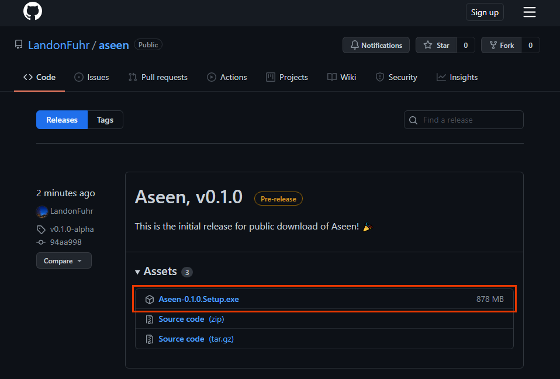
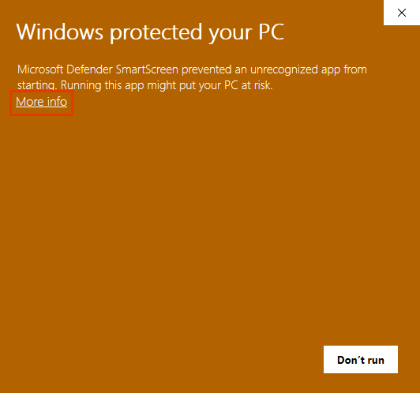
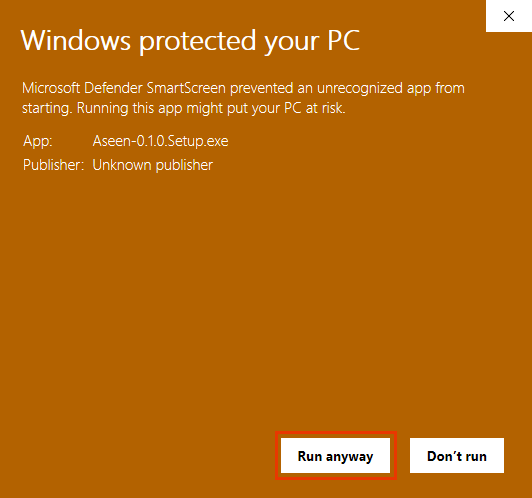
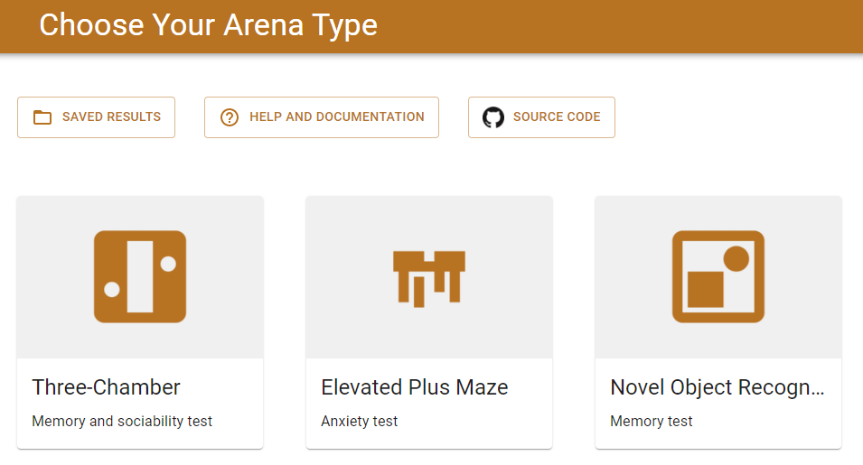
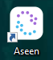

# Installation Guide

## Downloading Aseen

The first step to get started with Aseen is to download the program. Go to the latest release in [GitHub releases for Aseen](https://github.com/LandonFuhr/aseen/releases). Click on the _Assets_ dropdown to show the link to download the installer

## Installing Aseen

Open the `Aseen Setup.exe` file that you just downloaded.

!!!
You may get a warning from Windows when you try to open the installer. Aseen is open source and does not have any malicious intent. If you feel comfortable installing Aseen, click the dropdown below and follow the images
==- Getting past "_Windows protected your PC_"

===
!!!

This will take a second and then it will show a loading screen while it's installing

Once it finishes installing, it should automatically open the app!

It will also create an icon on your desktop that you can use to open it next time

[!ref icon="rocket" text="Go back to Quickstart Guide"](quickstart.md#start-analyzing)
