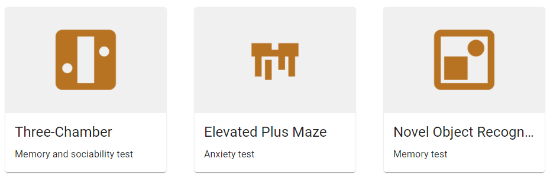
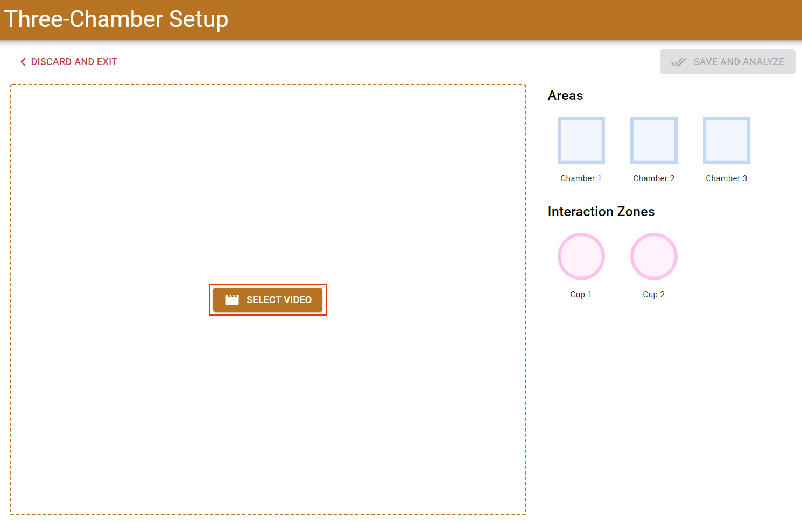

# Quickstart Guide

## Install

Go to the [Install Guide](install.md) to download and install Aseen. Come back here afterwards to see how to use it!
[!ref icon="download" text="Go to Install Guide"](install.md)

## Getting Started

Aseen works in 3 steps:

1. Select your arena type
2. Setup your video with shapes over the important parts
3. Let the computer do the hard work of analyzing the video!

### 1. Arena Type

The arena types are presets for common types of mouse behavioural tests. Right now, they include the following types:

- [Three-Chamber Test](behaviour-tests/three-chamber.md)
- [Elevated Plus Maze Test](behaviour-tests/epm.md)
- [Novel Object Recognition Test](behaviour-tests/nort.md)

For this tutorial, we will use the **Three-Chamber** arena type. Click on the card to go to the next screen

### 2. Video Setup

First, we need to pick which video to analyze. For this tutorial, you can download and use the sample video from here: [download sample video]()

Now that the video is loaded, it will show the three chambers and two cups that are standard in [three-chamber tests](behaviour-tests/three-chamber.md). We will have to adjust these a bit to match our video. Select each shape from the sidebar and then adjust it to match the video. You can also select a shape by click directly on video

The video will automatically start playing when the page loads. Use the controls at the bottom of the video to pause the video. You can use the seek bar to go to a different point in the video if it's easier to see the chambers or cups

